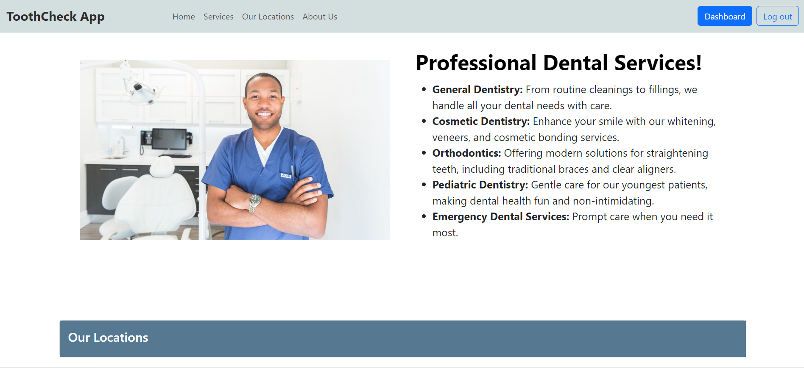
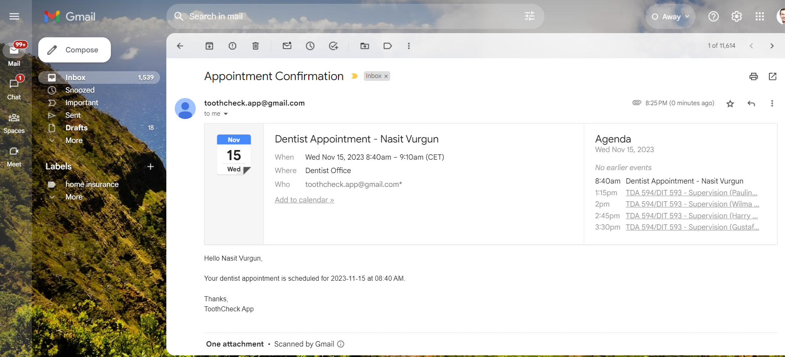
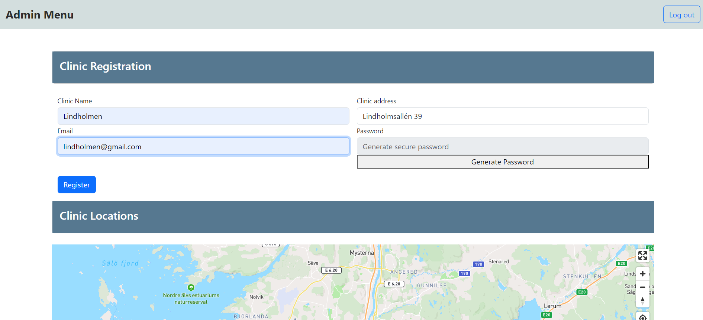
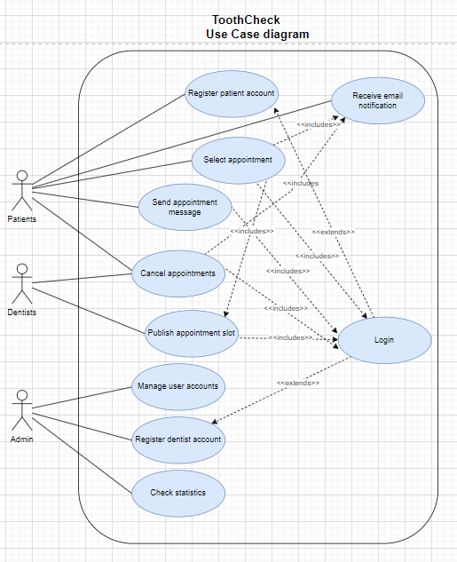
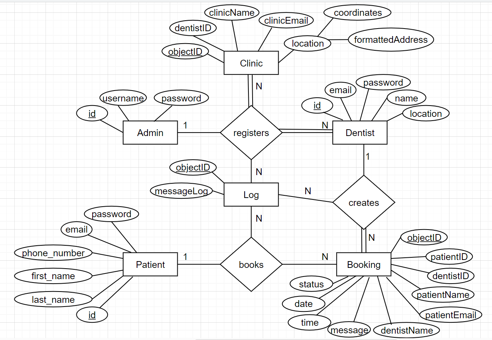
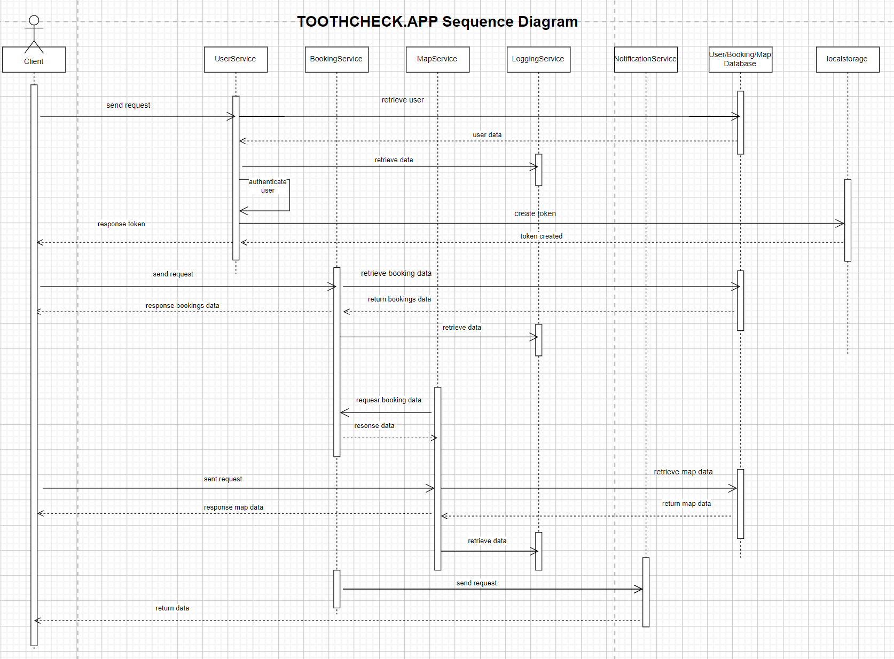
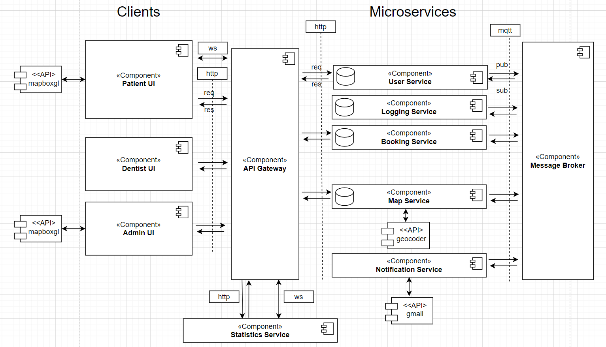
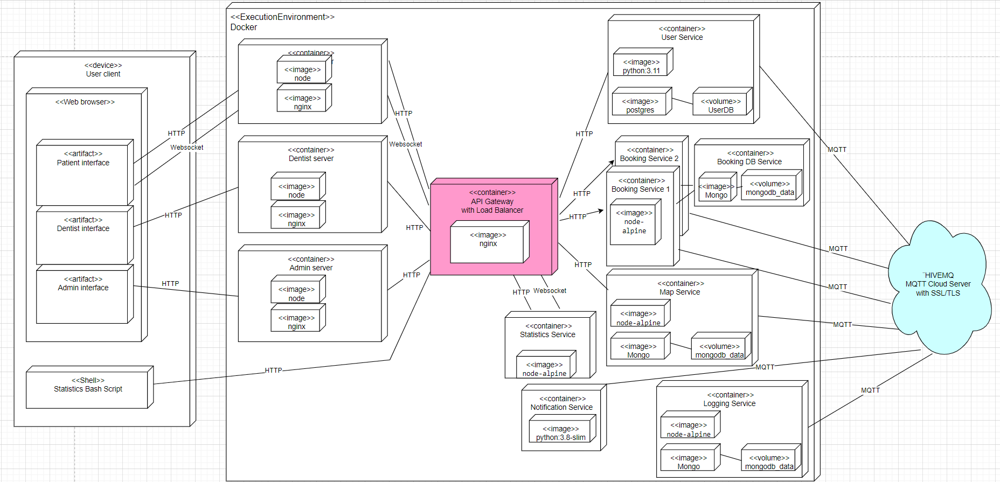

# ToothCheck - A Modern Dental Booking System

## Screenshots of System





## 4+1 View Model
We describe our system architecture using the 4+1 view model [1].

## Scenarios View - Use Case Diagram


## Logical View - ER Diagram
**Important Remark:** id denotes postgres ID, whereas objectID denotes mongoDB ID -- this is important for database consistency


## Process View - Sequence Diagram 
**Typical Use Case:** patient logs in and creates a booking.


## Development View - Component Diagram


## Physical View - Deployment Diagram


## Installation - Clone and Build Microservices, Deploy with Docker Compose

This is project uses a separate repository for each microservice.

### Prerequisites
You need to have Docker installed.

- [Docker](https://www.docker.com/)
### 1. Clone the Repository:

Open your terminal and navigate to the desired directory where you want to clone the main project repository:

```bash
git clone git@github.com:ToothCheck/Distributed-systems.git
```

This will clone the repository to your local machine.

### 2. Navigate to the Project Directory:

Enter the project directory:

```bash
cd distributed-systems
```

Inside this distributed folder clone:

```bash
git clone git@github.com:ToothCheck/API-gateway.git
git clone git@github.com:ToothCheck/Frontend-Admin.git
git clone git@github.com:ToothCheck/Frontend-Patient.git
git clone git@github.com:ToothCheck/Frontend-Dentist.git
git clone git@github.com:ToothCheck/Map-Service.git
```

### 3. Build Docker Images:

Run the following command to build the Docker images specified in the `docker-compose.yml` file:

```bash
docker-compose build
```

### 4. Start the Docker Containers:

After the images are built successfully, start the Docker containers in detached mode:

```bash
docker-compose up -d
```

This will start the services defined in your `docker-compose.yml` file.

### Logging Service Setup

#### Clone the Logging Service Repository

Clone the logging service repository from Git:

```bash
git clone git@github.com:ToothCheck/Logging-Service.git
```

#### Setup Logging Service

Navigate to the `logging-service` directory and build and run the Docker container:

```bash
cd logging-service
docker-compose build
docker-compose up -d
```

### Booking Service Setup

#### Clone the Booking Service Repository

Clone the booking service repository from Git:

```bash
git clone git@github.com:ToothCheck/Booking-Service.git
```

#### Setup Booking Service

Navigate to the `booking-service` directory and build and run the Docker container:

```bash
cd booking-service
docker-compose build
docker-compose up -d
```

### Notification Service Setup

#### Clone the Notification Service Repository

Clone the notification service repository from Git:

```bash
git clone git@github.com:ToothCheck/Notification-Service.git
```

After configuring the .env file as described in the readme, run the following script:
```
cd notification-service\src
python .\mqtt_handler.py
```
Create, cancel, or repost a booking to prompt OAuth 2.0 authorization in browser. Sign-in with mailing service gmail account. You will receive a `token.json`.

Navigate to the `src` directory and build and run the Docker container:

```bash
cd src
docker build -t notification-service .
docker run -p 4000:80 notification-service
```

### Statistics Service Setup
#### Clone the Statistics Service Repository

Clone the statistics service repository from Git:

```bash
git clone git@github.com:ToothCheck/Statistics-Service.git
```

#### Setup Statistics Service

Navigate to the `statistics-service` directory and build and run the Docker container:

```bash
cd statistics-service
docker build -t statistics-service .
docker run -p 5177:5177 statistics-service
```

#### User Service Setup

Follow the [readme ](https://github.com/ToothCheck/User-Service)file in the repo.

### Verify the Running Containers:

You can check the status of the running containers to ensure everything is working as expected:

```bash
docker ps
```

### References
[1] Kruchten, P. B. (1995). The 4+ 1 view model of architecture. IEEE software, 12(6), 42-50.
